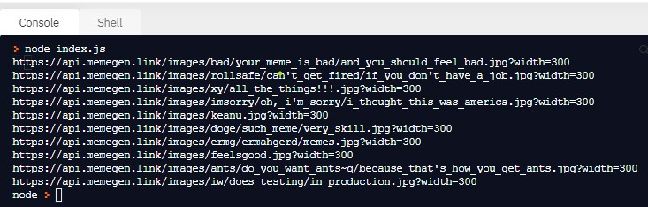
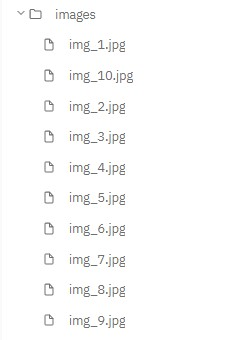

# meme-scraper

I build this app where the HTML from a specific webpage is read and then the URLs is parsed.

A new folder named `images` is created and there are downloaded the first 10 memes.

The command line to run the code is `node index.js`.

